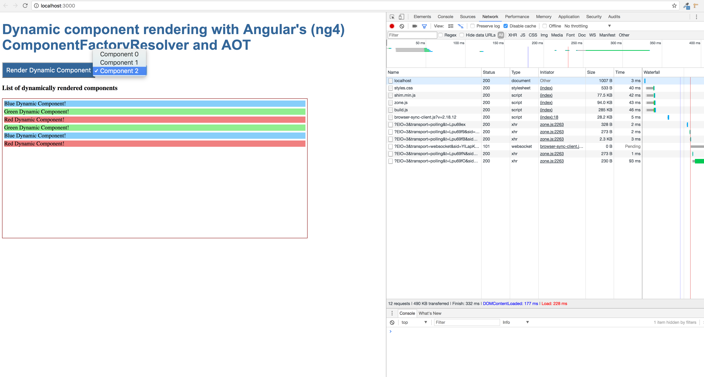

# angular_4_aot_with_component_factory_resolver
This is a project to test Ahead Of Time (AOT) compilation with angular's ComponentFactoryResolver

## How to run this project with AOT enabled?
- npm run build:aot
- npm run serve

I have followed following articles to understand, create and build this project.

[Understanding AOT and Dynamic Components in Angular 2](https://www.ag-grid.com/ag-grid-angular-aot-dynamic-components/)

[Ahead Of Time Compilation: Angular's Doc](https://angular.io/guide/aot-compiler)

## Key points
- You will run the ngc compiler provided in the @angular/compiler-cli npm package instead of the TypeScript compiler (tsc).
 ngc is a drop-in replacement for tsc and is configured much the same way.ngc requires its own tsconfig.json with AOT-oriented settings.
 - Make sure, package.json contains "@angular/compiler-cli": "~4.0.0" and "@angular/platform-server": "~4.0.0" .
- By making use of ANALYZE_FOR_ENTRY_COMPONENTS, we are able to add multiple components to the NgModule.entryComponents entry dynamically, in a user friendly way.
- If you encounter this problem `Cannot find module at '../aot/app/app.module.ngfactory'`, make sure you have specified correct file path i.e`'../aot/src/app/app.module.ngfactory'` not `'../aot/app/app.module.ngfactory'`.
- In a file tsconfig-aot.json, make sure "compilerOptions" has "target": "es5",
    "module": "es2015" and "lib": [
      "es2015",
      "dom"
    ] along with other attributes.

## Below is the final output of this project

